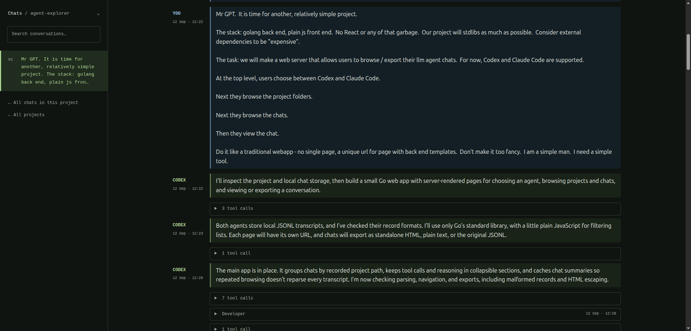

# Agent Explorer

A small, read-only web browser and exporter for local Codex, Claude Code, and pi chats.
Go standard library, server-rendered HTML, CSS, and a little plain JavaScript. No
external dependencies, database, frontend build step, or API keys.



## What does it do?

Agent Explorer turns the chat logs already on your disk into a readable local
website. Choose **an agent → a project → a conversation**, revisit the work, and
export a chat to keep or share. It reads your files without modifying them or
sending them to a service.

- Supports **Codex, Claude Code, and pi**; missing agent folders stay out of the UI.
- Groups consecutive tool calls behind one expandable line.
- Uses a compact dark interface: blue for you, green for the agent.
- Exports standalone **HTML**, readable **text**, or untouched **JSONL**.
- Runs as one executable with templates and assets embedded. No Node, npm,
  database, API keys, or frontend build ceremony.

## Download and run

Linux and Windows **x64 / amd64** builds are attached to each
[GitHub Release](https://github.com/stevelittlefish/agent-explorer/releases).
Open the latest release and download the `.tar.gz` (Linux) or `.zip` (Windows)
under **Assets** — no sign-in required. Each package contains the executable, this
README, the license, and `SHA256SUMS` for checking the executable.

**Linux:**

```sh
tar -xzf agent-explorer-linux-amd64.tar.gz
./agent-explorer
```

**Windows (PowerShell):**

```powershell
Expand-Archive .\agent-explorer-windows-amd64.zip -DestinationPath .\agent-explorer
cd .\agent-explorer
.\agent-explorer.exe
```

Open **http://127.0.0.1:8484**. Keep the terminal open while browsing; press `Ctrl+C`
to stop the server. Use `-addr 127.0.0.1:8087` if port 8484 is occupied.

**Apple builds? No.** We are not volunteering for signed-executable bureaucracy,
notarisation rituals, or a guided tour of somebody else's walled garden.
**Steve Jobs, we just want to run a binary, not apply for planning permission
inside your fruit-shaped kingdom.** Linux and Windows get the automated builds.
Mac users are welcome to try building from source; bring your own ceremonial turtleneck.

## Run from source

Requires Go 1.23 or newer:

```sh
go run .
```

Each screen has its own URL and works without JavaScript. JavaScript adds list
filtering, code copying, and an expand/collapse button for conversation details.

The Phosphor interface uses a dark forest palette, green accents, and a project
chat index beside the conversation. Compact message spacing keeps more of the
conversation in view: your messages are blue and agent replies are green.
Consecutive tool calls and their results fold into a single expandable count
(e.g. "4 tool calls"); outputs do not count as additional calls. The grouping also
works in standalone HTML exports and with JavaScript disabled. On narrow screens the index folds into a
disclosure above the chat. Keyboard navigation and reduced-motion preferences
are supported.

Default data locations:

- Codex: `~/.codex/sessions` and `~/.codex/archived_sessions`.
- Claude Code: `~/.claude/projects`, including nested subagent transcripts.
- pi: `~/.pi/agent/sessions`.

`CODEX_HOME`, `CLAUDE_CONFIG_DIR`, and `PI_CODING_AGENT_DIR` override the default
agent data directories.
You can also specify them explicitly:

```sh
go run . -addr 127.0.0.1:8484 -codex-dir /path/to/.codex -claude-dir /path/to/.claude -pi-dir /path/to/.pi/agent
```

The server binds to loopback by default. It has no authentication; use it locally.
All transcript access is read-only. Agents appear in the home page and navigation
only when their configured data directory (or session directory) exists. An existing
agent directory with no chats shows an empty list. Folder discovery refreshes on
each request; absent agents return 404 if opened directly.

For a custom pi session location, use `-pi-sessions-dir /path/to/sessions` or
`PI_CODING_AGENT_SESSION_DIR`.
Project folders come from recorded working directories; those folders do not need
to exist anymore. Chat lists show most recently modified transcripts first.

## Exports

Each conversation offers:

- **HTML:** a standalone file with embedded styles, escaped message text, and
  expandable tool calls and reasoning. No server or network access needed to read it.
- **Text:** the readable transcript, including tool calls and reasoning.
- **Original JSONL:** the source transcript, unchanged, including original metadata.

Message text and internal whitespace are preserved, with fenced code shown in separate
code blocks. Other Markdown remains readable source text.
Images appear as attachment placeholders; original attachment records remain in
JSONL exports. Provider bookkeeping records and encrypted reasoning are omitted
from readable views. Malformed records are skipped with a warning. Codex response
records take precedence over duplicate event messages; older event-only transcripts
are also supported. pi supports named sessions, messages, thinking, tool calls and
results, shell executions, and saved compaction/branch summaries. pi entries are
shown in file order, including saved branches; original tree metadata remains in
the JSONL export.

Chat summaries are cached in memory and refreshed when files change. The selected
conversation is read again on each request. No imported copies or indexes are
written to disk.

## FAQ

**Steve, if I download the executable of your shitty app, how do I know it will
not infect me with viruses?**

Look at the source code — it's all right here. If you don't trust it, build from
source and read every line on the way. We can't tell you what to do; we're not your
mum. (For what it's worth: no network calls, no database, no telemetry, and every
package ships a `SHA256SUMS` so you can confirm the bytes are the bytes.)

**Steve, there are lots of digs at Apple. Are you an Apple hater?**

Not at all — Apple make genuinely good products. They're just not for me. I don't
like how uncustomisable everything is, but the real dealbreaker is this: I DO NOT
WANT TO SIGN MY STUPID APP WITH THEIR CRAPPY DEV TOOLS. The friction is too high,
the walls of the garden are too tall, and I'm not willing to buy their overpriced
(but, honestly, quite lovely) hardware with its weird, non-standard keyboard
layout. Admiration and refusal can coexist. This is that.

**Does this mean you're a Windows fanboy instead?**

God, no. I don't like Apple, but Windows is a steaming pile of garbage. It has
exactly one redeeming quality here: shipping a Windows executable is easy, and a
great many people have been brainwashed into believing Windows is The One True
Operating System — an evil lie spread by THE ORGANIZATION. Everyone knows that
Linux is The One True Operating System. We build for Windows out of mercy, not
loyalty.

**Steve, why isn't *&lt;insert coding agent&gt;* supported by your shitty tool?**

Probably because I don't use *&lt;insert coding agent&gt;*. If it's free and widely
available, I can add it. Just ask me — say "pretty please with a cherry on top" —
and if I got out of the right side of bed that day, I might add it.

Or you could just use *&lt;insert coding agent&gt;* yourself and submit a PR.

**Which coding agent did you use to build this?**

Codex with GPT 6 Astra. But then Claude got his grubby fingers on it and couldn't
resist co-authoring a few commits to make it look like he did it. Naughty Claude.

## Build and test

```sh
go test ./...
go vet ./...
go build -o agent-explorer .
./agent-explorer
```

Templates and static assets are embedded in the binary. Rebuild after changing them.

## Releasing

Releasing is driven entirely by pushing a version tag. Everything else — building,
testing, creating the GitHub Release, and attaching the downloads — is automatic.
To cut a release:

```sh
git tag v1.0.0
git push origin v1.0.0
```

Or use the helper, which shows the latest tag and suggests the next one when run
with no arguments:

```sh
scripts/release.sh           # e.g. "Latest: v1.0.0  Suggested next: v1.0.1"
scripts/release.sh v1.0.1    # tag and push, cutting the release
```

Pushing a `v*` tag fires the Build workflow. It runs native Linux and Windows jobs:
each runs race-enabled tests and `go vet`, builds an amd64 executable with CGO
disabled, checks that it starts with `-help`, and packages it. A final job then
creates a GitHub Release named after the tag (with auto-generated notes) and uploads
the Linux `.tar.gz` and Windows `.zip` to it as assets. CI uses the latest stable Go
release. The same packages are also kept on the workflow run for 30 days. No macOS
job sneaks in through the garden gate, Steve Jobs.

To test a build without cutting a release, open the
[Build workflow](https://github.com/stevelittlefish/agent-explorer/actions/workflows/build.yml)
on the Actions tab and use **Run workflow**; a manual run builds and packages but
does not create a Release.
